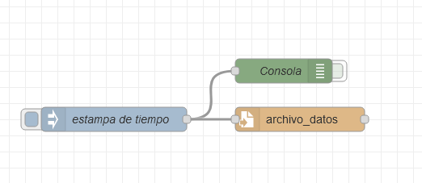

# Usando Node-Red para generar y guardar datos en un archivo

## Imagen del flow resultante



## Codigo fuente

Importar el siguiente código a su node-red.

```json
[
  {
    "id": "5ed147f3.6e8a08",
    "type": "tab",
    "label": "1-Entrada-Salida",
    "disabled": false,
    "info": ""
  },
  {
    "id": "c9c99650.2ad88",
    "type": "file",
    "z": "5ed147f3.6e8a08",
    "name": "",
    "filename": "archivo_datos",
    "appendNewline": true,
    "createDir": false,
    "overwriteFile": "false",
    "encoding": "none",
    "x": 440,
    "y": 200,
    "wires": [[]]
  },
  {
    "id": "967106ea.6e1ef",
    "type": "debug",
    "z": "5ed147f3.6e8a08",
    "name": "Consola",
    "active": false,
    "tosidebar": true,
    "console": false,
    "tostatus": false,
    "complete": "payload",
    "targetType": "msg",
    "statusVal": "",
    "statusType": "auto",
    "x": 420,
    "y": 140,
    "wires": []
  },
  {
    "id": "72162f7f.3f34a",
    "type": "inject",
    "z": "5ed147f3.6e8a08",
    "name": "estampa de tiempo",
    "props": [
      {
        "p": "payload"
      }
    ],
    "repeat": "",
    "crontab": "",
    "once": false,
    "onceDelay": 0.1,
    "topic": "",
    "payload": "",
    "payloadType": "date",
    "x": 210,
    "y": 200,
    "wires": [["967106ea.6e1ef", "c9c99650.2ad88"]]
  }
]
```
