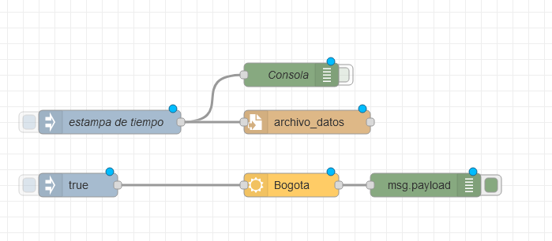

# Usando Node-Red para obtener datos climáticos y guardarlos datos en un archivo



```json
[
    {
        "id": "eaaed1d6.9db558",
        "type": "tab",
        "label": "2-DatosClimaticos",
        "disabled": false,
        "info": ""
    },
    {
        "id": "dbbe0f30.1ea3",
        "type": "openweathermap",
        "z": "eaaed1d6.9db558",
        "name": "",
        "wtype": "current",
        "lon": "",
        "lat": "",
        "city": "Bogota",
        "country": "CO",
        "language": "en",
        "x": 540,
        "y": 320,
        "wires": [
            [
                "50bf2547.3d547c"
            ]
        ]
    },
    {
        "id": "b48af3b4.0d753",
        "type": "inject",
        "z": "eaaed1d6.9db558",
        "name": "",
        "props": [
            {
                "p": "payload"
            }
        ],
        "repeat": "",
        "crontab": "",
        "once": false,
        "onceDelay": 0.1,
        "topic": "",
        "payload": "true",
        "payloadType": "bool",
        "x": 270,
        "y": 320,
        "wires": [
            [
                "dbbe0f30.1ea3"
            ]
        ]
    },
    {
        "id": "50bf2547.3d547c",
        "type": "debug",
        "z": "eaaed1d6.9db558",
        "name": "",
        "active": true,
        "tosidebar": true,
        "console": false,
        "tostatus": false,
        "complete": "payload",
        "targetType": "msg",
        "statusVal": "",
        "statusType": "auto",
        "x": 710,
        "y": 320,
        "wires": []
    },
    {
        "id": "e3725b52.f1a238",
        "type": "file",
        "z": "eaaed1d6.9db558",
        "name": "",
        "filename": "archivo_datos",
        "appendNewline": true,
        "createDir": false,
        "overwriteFile": "false",
        "encoding": "none",
        "x": 540,
        "y": 240,
        "wires": [
            []
        ]
    },
    {
        "id": "b1e8cfe1.aa8b3",
        "type": "debug",
        "z": "eaaed1d6.9db558",
        "name": "Consola",
        "active": false,
        "tosidebar": true,
        "console": false,
        "tostatus": false,
        "complete": "payload",
        "targetType": "msg",
        "statusVal": "",
        "statusType": "auto",
        "x": 520,
        "y": 180,
        "wires": []
    },
    {
        "id": "8645f730.95cf48",
        "type": "inject",
        "z": "eaaed1d6.9db558",
        "name": "estampa de tiempo",
        "props": [
            {
                "p": "payload"
            }
        ],
        "repeat": "",
        "crontab": "",
        "once": false,
        "onceDelay": 0.1,
        "topic": "",
        "payload": "",
        "payloadType": "date",
        "x": 310,
        "y": 240,
        "wires": [
            [
                "b1e8cfe1.aa8b3",
                "e3725b52.f1a238"
            ]
        ]
    }
]
```