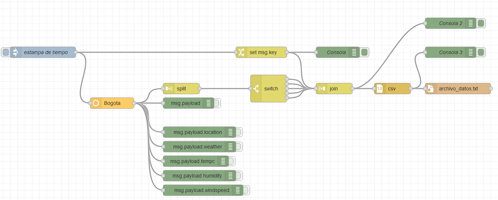

# Usando Node-Red para obtener datos climáticos y guardarlos datos en un archivo



Poner su API key en el bloque de OpenWeather.


```json
[
  {[
    {
        "id": "eaaed1d6.9db558",
        "type": "tab",
        "label": "2-DatosClimaticos",
        "disabled": false,
        "info": ""
    },
    {
        "id": "dbbe0f30.1ea3",
        "type": "openweathermap",
        "z": "eaaed1d6.9db558",
        "name": "",
        "wtype": "current",
        "lon": "",
        "lat": "",
        "city": "Bogota",
        "country": "CO",
        "language": "en",
        "x": 320,
        "y": 320,
        "wires": [
            [
                "50bf2547.3d547c",
                "48a2d975.3581b8",
                "7b5cdec4.66546",
                "6f4eea6a.fe659c",
                "9890d972.3a1c58",
                "b6501d7a.9ad97",
                "99da6ddc.033f58"
            ]
        ]
    },
    {
        "id": "50bf2547.3d547c",
        "type": "debug",
        "z": "eaaed1d6.9db558",
        "name": "",
        "active": false,
        "tosidebar": true,
        "console": false,
        "tostatus": false,
        "complete": "payload",
        "targetType": "msg",
        "statusVal": "",
        "statusType": "auto",
        "x": 530,
        "y": 320,
        "wires": []
    },
    {
        "id": "b1e8cfe1.aa8b3",
        "type": "debug",
        "z": "eaaed1d6.9db558",
        "name": "Consola",
        "active": true,
        "tosidebar": true,
        "console": false,
        "tostatus": false,
        "complete": "true",
        "targetType": "full",
        "statusVal": "",
        "statusType": "auto",
        "x": 940,
        "y": 180,
        "wires": []
    },
    {
        "id": "8645f730.95cf48",
        "type": "inject",
        "z": "eaaed1d6.9db558",
        "name": "estampa de tiempo",
        "props": [
            {
                "p": "payload"
            }
        ],
        "repeat": "",
        "crontab": "",
        "once": false,
        "onceDelay": 0.1,
        "topic": "",
        "payload": "",
        "payloadType": "date",
        "x": 130,
        "y": 180,
        "wires": [
            [
                "dbbe0f30.1ea3",
                "4dbefc6.2479004"
            ]
        ]
    },
    {
        "id": "48a2d975.3581b8",
        "type": "debug",
        "z": "eaaed1d6.9db558",
        "name": "",
        "active": false,
        "tosidebar": true,
        "console": false,
        "tostatus": false,
        "complete": "payload.location",
        "targetType": "msg",
        "statusVal": "",
        "statusType": "auto",
        "x": 560,
        "y": 400,
        "wires": []
    },
    {
        "id": "7b5cdec4.66546",
        "type": "debug",
        "z": "eaaed1d6.9db558",
        "name": "",
        "active": false,
        "tosidebar": true,
        "console": false,
        "tostatus": false,
        "complete": "payload.weather",
        "targetType": "msg",
        "statusVal": "",
        "statusType": "auto",
        "x": 560,
        "y": 440,
        "wires": []
    },
    {
        "id": "6f4eea6a.fe659c",
        "type": "debug",
        "z": "eaaed1d6.9db558",
        "name": "",
        "active": false,
        "tosidebar": true,
        "console": false,
        "tostatus": false,
        "complete": "payload.tempc",
        "targetType": "msg",
        "statusVal": "",
        "statusType": "auto",
        "x": 550,
        "y": 480,
        "wires": []
    },
    {
        "id": "9890d972.3a1c58",
        "type": "debug",
        "z": "eaaed1d6.9db558",
        "name": "",
        "active": false,
        "tosidebar": true,
        "console": false,
        "tostatus": false,
        "complete": "payload.humidity",
        "targetType": "msg",
        "statusVal": "",
        "statusType": "auto",
        "x": 560,
        "y": 520,
        "wires": []
    },
    {
        "id": "b6501d7a.9ad97",
        "type": "debug",
        "z": "eaaed1d6.9db558",
        "name": "",
        "active": false,
        "tosidebar": true,
        "console": false,
        "tostatus": false,
        "complete": "payload.windspeed",
        "targetType": "msg",
        "statusVal": "",
        "statusType": "auto",
        "x": 570,
        "y": 560,
        "wires": []
    },
    {
        "id": "1073b3ae.cfe82c",
        "type": "debug",
        "z": "eaaed1d6.9db558",
        "name": "Consola 3",
        "active": true,
        "tosidebar": true,
        "console": false,
        "tostatus": false,
        "complete": "payload",
        "targetType": "msg",
        "statusVal": "",
        "statusType": "auto",
        "x": 1250,
        "y": 180,
        "wires": []
    },
    {
        "id": "e3725b52.f1a238",
        "type": "file",
        "z": "eaaed1d6.9db558",
        "name": "",
        "filename": "archivo_datos.txt",
        "appendNewline": true,
        "createDir": true,
        "overwriteFile": "false",
        "encoding": "none",
        "x": 1270,
        "y": 280,
        "wires": [
            []
        ]
    },
    {
        "id": "99da6ddc.033f58",
        "type": "split",
        "z": "eaaed1d6.9db558",
        "name": "",
        "splt": "\\n",
        "spltType": "str",
        "arraySplt": 1,
        "arraySpltType": "len",
        "stream": true,
        "addname": "key",
        "x": 510,
        "y": 280,
        "wires": [
            [
                "15f9ff1.cf1f681"
            ]
        ]
    },
    {
        "id": "15f9ff1.cf1f681",
        "type": "switch",
        "z": "eaaed1d6.9db558",
        "name": "",
        "property": "key",
        "propertyType": "msg",
        "rules": [
            {
                "t": "eq",
                "v": "location",
                "vt": "str"
            },
            {
                "t": "eq",
                "v": "weather",
                "vt": "str"
            },
            {
                "t": "eq",
                "v": "tempc",
                "vt": "str"
            },
            {
                "t": "eq",
                "v": "humidity",
                "vt": "str"
            },
            {
                "t": "eq",
                "v": "windspeed",
                "vt": "str"
            }
        ],
        "checkall": "true",
        "repair": false,
        "outputs": 5,
        "x": 750,
        "y": 280,
        "wires": [
            [
                "3bd48e6e.c3d462"
            ],
            [
                "3bd48e6e.c3d462"
            ],
            [
                "3bd48e6e.c3d462"
            ],
            [
                "3bd48e6e.c3d462"
            ],
            [
                "3bd48e6e.c3d462"
            ]
        ]
    },
    {
        "id": "5af81f87.3e28e",
        "type": "debug",
        "z": "eaaed1d6.9db558",
        "name": "Consola 2",
        "active": true,
        "tosidebar": true,
        "console": false,
        "tostatus": false,
        "complete": "payload",
        "targetType": "msg",
        "statusVal": "",
        "statusType": "auto",
        "x": 1250,
        "y": 100,
        "wires": []
    },
    {
        "id": "e60cb02e.c60fa",
        "type": "csv",
        "z": "eaaed1d6.9db558",
        "name": "",
        "sep": ",",
        "hdrin": false,
        "hdrout": "once",
        "multi": "mult",
        "ret": "\\r\\n",
        "temp": "timestamp,location,weather,tempc,humidity,windspeed",
        "skip": "0",
        "strings": true,
        "include_empty_strings": "",
        "include_null_values": "",
        "x": 1090,
        "y": 280,
        "wires": [
            [
                "e3725b52.f1a238",
                "1073b3ae.cfe82c"
            ]
        ]
    },
    {
        "id": "3bd48e6e.c3d462",
        "type": "join",
        "z": "eaaed1d6.9db558",
        "name": "",
        "mode": "custom",
        "build": "object",
        "property": "payload",
        "propertyType": "msg",
        "key": "key",
        "joiner": "\\n",
        "joinerType": "str",
        "accumulate": false,
        "timeout": "",
        "count": "6",
        "reduceRight": false,
        "reduceExp": "",
        "reduceInit": "",
        "reduceInitType": "num",
        "reduceFixup": "",
        "x": 930,
        "y": 280,
        "wires": [
            [
                "5af81f87.3e28e",
                "e60cb02e.c60fa"
            ]
        ]
    },
    {
        "id": "4dbefc6.2479004",
        "type": "change",
        "z": "eaaed1d6.9db558",
        "name": "",
        "rules": [
            {
                "t": "set",
                "p": "key",
                "pt": "msg",
                "to": "timestamp",
                "tot": "str"
            }
        ],
        "action": "",
        "property": "",
        "from": "",
        "to": "",
        "reg": false,
        "x": 730,
        "y": 180,
        "wires": [
            [
                "b1e8cfe1.aa8b3",
                "3bd48e6e.c3d462"
            ]
        ]
    }
]
```
