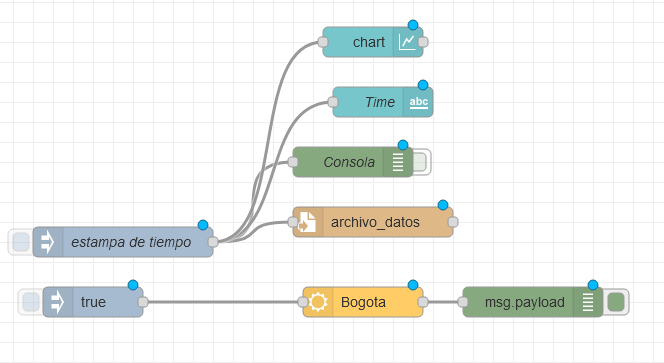

# Usando Node-Red para obtener datos climáticos, guardarlos en un archivo y mostrarlos en un dashboard web

## Imagen del flow resultante



## Codigo fuente

Importar el siguiente código a su node-red.

```json
[
  {
    "id": "8573b131.ad22a8",
    "type": "tab",
    "label": "3-Dashboard",
    "disabled": false,
    "info": ""
  },
  {
    "id": "6ebab737.cb3f58",
    "type": "openweathermap",
    "z": "8573b131.ad22a8",
    "name": "",
    "wtype": "current",
    "lon": "",
    "lat": "",
    "city": "Bogota",
    "country": "CO",
    "language": "en",
    "x": 580,
    "y": 440,
    "wires": [["4d876d66.d27024"]]
  },
  {
    "id": "21394fbb.86c4",
    "type": "inject",
    "z": "8573b131.ad22a8",
    "name": "",
    "props": [
      {
        "p": "payload"
      }
    ],
    "repeat": "",
    "crontab": "",
    "once": false,
    "onceDelay": 0.1,
    "topic": "",
    "payload": "true",
    "payloadType": "bool",
    "x": 310,
    "y": 440,
    "wires": [["6ebab737.cb3f58"]]
  },
  {
    "id": "4d876d66.d27024",
    "type": "debug",
    "z": "8573b131.ad22a8",
    "name": "",
    "active": true,
    "tosidebar": true,
    "console": false,
    "tostatus": false,
    "complete": "payload",
    "targetType": "msg",
    "statusVal": "",
    "statusType": "auto",
    "x": 750,
    "y": 440,
    "wires": []
  },
  {
    "id": "ef346412.1b39e",
    "type": "file",
    "z": "8573b131.ad22a8",
    "name": "",
    "filename": "archivo_datos",
    "appendNewline": true,
    "createDir": false,
    "overwriteFile": "false",
    "encoding": "none",
    "x": 580,
    "y": 360,
    "wires": [[]]
  },
  {
    "id": "4bbe8924.9e56a8",
    "type": "debug",
    "z": "8573b131.ad22a8",
    "name": "Consola",
    "active": false,
    "tosidebar": true,
    "console": false,
    "tostatus": false,
    "complete": "payload",
    "targetType": "msg",
    "statusVal": "",
    "statusType": "auto",
    "x": 560,
    "y": 300,
    "wires": []
  },
  {
    "id": "7765e20e.69d444",
    "type": "inject",
    "z": "8573b131.ad22a8",
    "name": "estampa de tiempo",
    "props": [
      {
        "p": "payload"
      }
    ],
    "repeat": "",
    "crontab": "",
    "once": false,
    "onceDelay": 0.1,
    "topic": "",
    "payload": "",
    "payloadType": "date",
    "x": 350,
    "y": 360,
    "wires": [
      [
        "4bbe8924.9e56a8",
        "ef346412.1b39e",
        "b68f4a1c.690138",
        "479c061d.78e758"
      ]
    ]
  },
  {
    "id": "b68f4a1c.690138",
    "type": "ui_text",
    "z": "8573b131.ad22a8",
    "group": "a991ed42.6fe55",
    "order": 0,
    "width": 0,
    "height": 0,
    "name": "Time",
    "label": "text",
    "format": "{{msg.payload}}",
    "layout": "row-spread",
    "x": 550,
    "y": 220,
    "wires": []
  },
  {
    "id": "479c061d.78e758",
    "type": "ui_chart",
    "z": "8573b131.ad22a8",
    "name": "",
    "group": "a991ed42.6fe55",
    "order": 1,
    "width": 0,
    "height": 0,
    "label": "chart",
    "chartType": "line",
    "legend": "false",
    "xformat": "auto",
    "interpolate": "linear",
    "nodata": "",
    "dot": true,
    "ymin": "",
    "ymax": "",
    "removeOlder": 1,
    "removeOlderPoints": "10",
    "removeOlderUnit": "3600",
    "cutout": 0,
    "useOneColor": false,
    "useUTC": false,
    "colors": [
      "#1f77b4",
      "#aec7e8",
      "#ff7f0e",
      "#2ca02c",
      "#98df8a",
      "#d62728",
      "#ff9896",
      "#9467bd",
      "#c5b0d5"
    ],
    "useOldStyle": false,
    "outputs": 1,
    "x": 550,
    "y": 160,
    "wires": [[]]
  },
  {
    "id": "a991ed42.6fe55",
    "type": "ui_group",
    "name": "Group 1",
    "tab": "107426c9.54de41",
    "order": 1,
    "disp": true,
    "width": 6
  },
  {
    "id": "107426c9.54de41",
    "type": "ui_tab",
    "name": "Tab 1",
    "icon": "dashboard",
    "order": 1,
    "disabled": false,
    "hidden": false
  }
]
```
