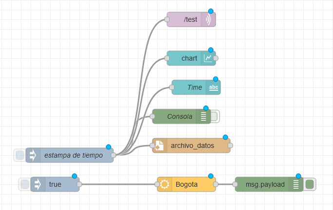

# Usando Node-Red para obtener datos climáticos, guardarlos en un archivo, mostrarlos en un dashboard web y comunicarse con un proveedor IoT (MQTT)

## Imagen del flow resultante



```json
[
  {
    "id": "3e0ede40.77ca12",
    "type": "tab",
    "label": "4-MQTT",
    "disabled": false,
    "info": ""
  },
  {
    "id": "e16f2b4f.75198",
    "type": "openweathermap",
    "z": "3e0ede40.77ca12",
    "name": "",
    "wtype": "current",
    "lon": "",
    "lat": "",
    "city": "Bogota",
    "country": "CO",
    "language": "en",
    "x": 580,
    "y": 460,
    "wires": [["3f44d073.c3848"]]
  },
  {
    "id": "b958ed0f.6d5fb8",
    "type": "inject",
    "z": "3e0ede40.77ca12",
    "name": "",
    "props": [
      {
        "p": "payload"
      }
    ],
    "repeat": "",
    "crontab": "",
    "once": false,
    "onceDelay": 0.1,
    "topic": "",
    "payload": "true",
    "payloadType": "bool",
    "x": 310,
    "y": 460,
    "wires": [["e16f2b4f.75198"]]
  },
  {
    "id": "3f44d073.c3848",
    "type": "debug",
    "z": "3e0ede40.77ca12",
    "name": "",
    "active": true,
    "tosidebar": true,
    "console": false,
    "tostatus": false,
    "complete": "payload",
    "targetType": "msg",
    "statusVal": "",
    "statusType": "auto",
    "x": 750,
    "y": 460,
    "wires": []
  },
  {
    "id": "fca27311.89fed8",
    "type": "file",
    "z": "3e0ede40.77ca12",
    "name": "",
    "filename": "archivo_datos",
    "appendNewline": true,
    "createDir": false,
    "overwriteFile": "false",
    "encoding": "none",
    "x": 580,
    "y": 380,
    "wires": [[]]
  },
  {
    "id": "848eb5b4.50356",
    "type": "debug",
    "z": "3e0ede40.77ca12",
    "name": "Consola",
    "active": false,
    "tosidebar": true,
    "console": false,
    "tostatus": false,
    "complete": "payload",
    "targetType": "msg",
    "statusVal": "",
    "statusType": "auto",
    "x": 560,
    "y": 320,
    "wires": []
  },
  {
    "id": "dc741b2.3b649e8",
    "type": "inject",
    "z": "3e0ede40.77ca12",
    "name": "estampa de tiempo",
    "props": [
      {
        "p": "payload"
      }
    ],
    "repeat": "",
    "crontab": "",
    "once": false,
    "onceDelay": 0.1,
    "topic": "",
    "payload": "",
    "payloadType": "date",
    "x": 350,
    "y": 380,
    "wires": [
      [
        "848eb5b4.50356",
        "fca27311.89fed8",
        "aa15b839.b66108",
        "76291f43.51879",
        "164f0036.271e48"
      ]
    ]
  },
  {
    "id": "aa15b839.b66108",
    "type": "ui_text",
    "z": "3e0ede40.77ca12",
    "group": "a991ed42.6fe55",
    "order": 0,
    "width": 0,
    "height": 0,
    "name": "Time",
    "label": "text",
    "format": "{{msg.payload}}",
    "layout": "row-spread",
    "x": 550,
    "y": 240,
    "wires": []
  },
  {
    "id": "76291f43.51879",
    "type": "ui_chart",
    "z": "3e0ede40.77ca12",
    "name": "",
    "group": "a991ed42.6fe55",
    "order": 1,
    "width": 0,
    "height": 0,
    "label": "chart",
    "chartType": "line",
    "legend": "false",
    "xformat": "auto",
    "interpolate": "linear",
    "nodata": "",
    "dot": true,
    "ymin": "",
    "ymax": "",
    "removeOlder": 1,
    "removeOlderPoints": "10",
    "removeOlderUnit": "3600",
    "cutout": 0,
    "useOneColor": false,
    "useUTC": false,
    "colors": [
      "#1f77b4",
      "#aec7e8",
      "#ff7f0e",
      "#2ca02c",
      "#98df8a",
      "#d62728",
      "#ff9896",
      "#9467bd",
      "#c5b0d5"
    ],
    "useOldStyle": false,
    "outputs": 1,
    "x": 550,
    "y": 180,
    "wires": [[]]
  },
  {
    "id": "164f0036.271e48",
    "type": "mqtt out",
    "z": "3e0ede40.77ca12",
    "name": "",
    "topic": "/test",
    "qos": "2",
    "retain": "false",
    "broker": "727fd214.54d0c4",
    "x": 550,
    "y": 100,
    "wires": []
  },
  {
    "id": "a991ed42.6fe55",
    "type": "ui_group",
    "name": "Group 1",
    "tab": "107426c9.54de41",
    "order": 1,
    "disp": true,
    "width": 6
  },
  {
    "id": "727fd214.54d0c4",
    "type": "mqtt-broker",
    "name": "local",
    "broker": "localhost",
    "port": "1883",
    "clientid": "",
    "usetls": false,
    "compatmode": false,
    "keepalive": "60",
    "cleansession": true,
    "birthTopic": "",
    "birthQos": "0",
    "birthPayload": "",
    "closeTopic": "",
    "closeQos": "0",
    "closePayload": "",
    "willTopic": "",
    "willQos": "0",
    "willPayload": ""
  },
  {
    "id": "107426c9.54de41",
    "type": "ui_tab",
    "name": "Tab 1",
    "icon": "dashboard",
    "order": 1,
    "disabled": false,
    "hidden": false
  }
]
```
