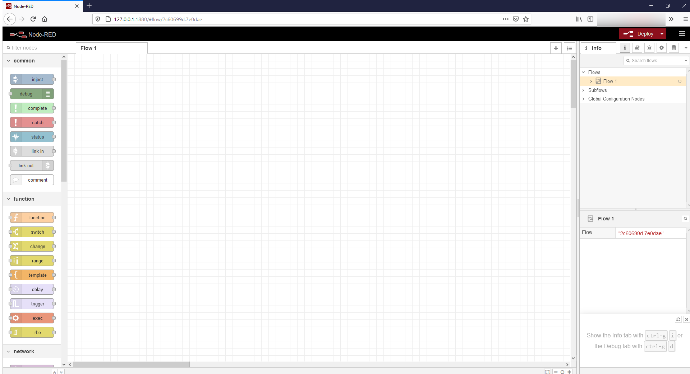
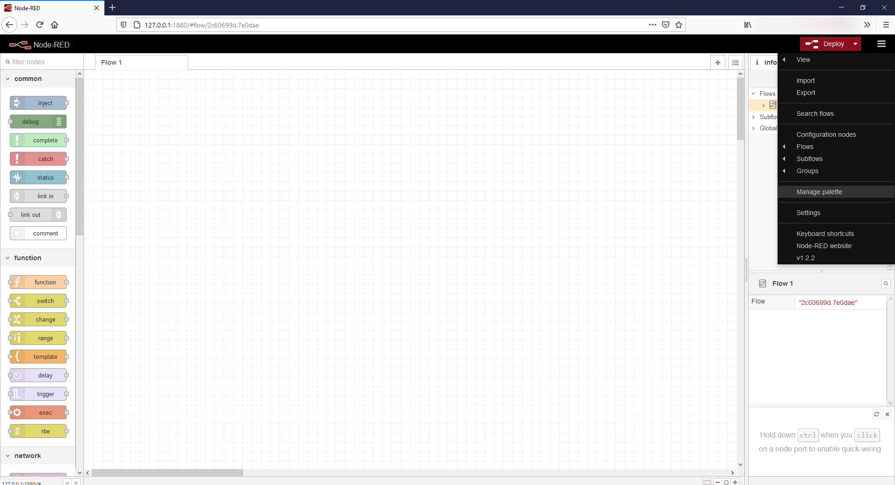
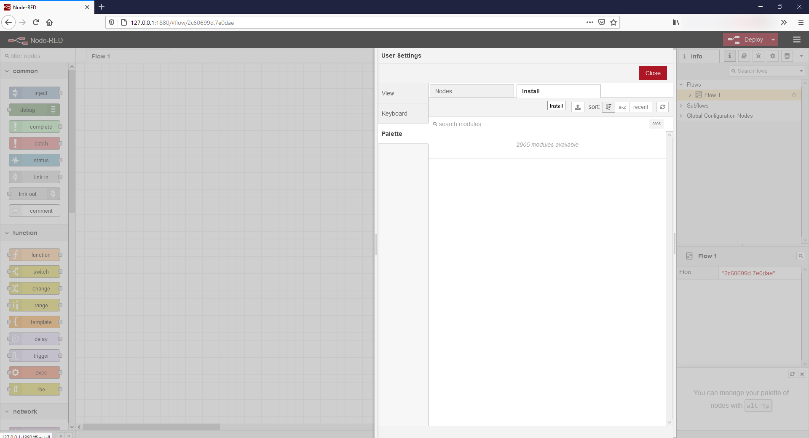
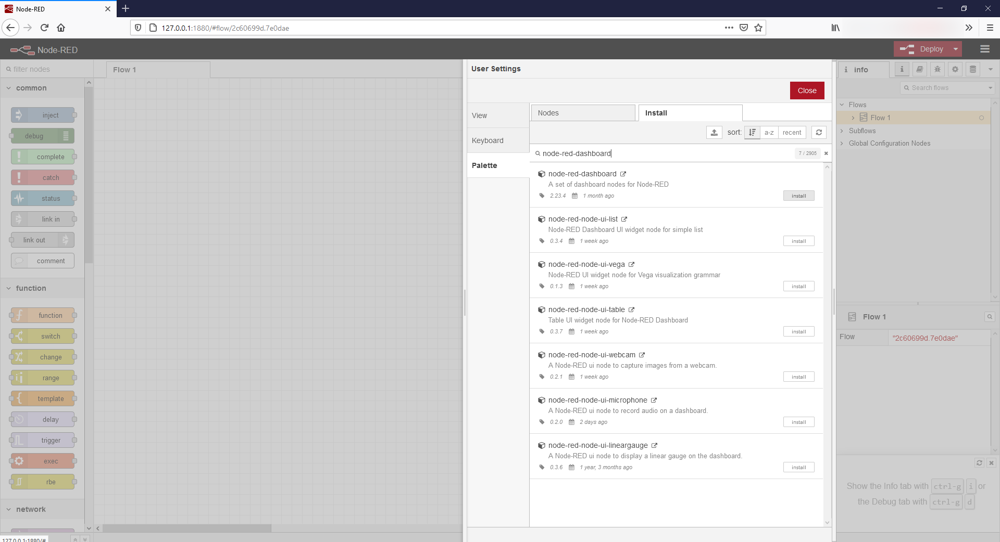
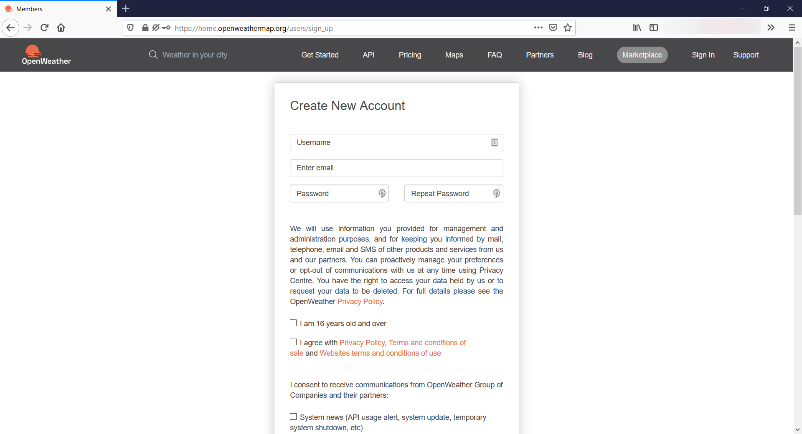
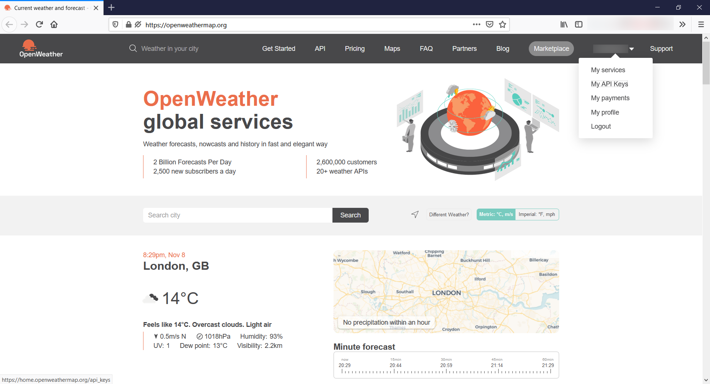
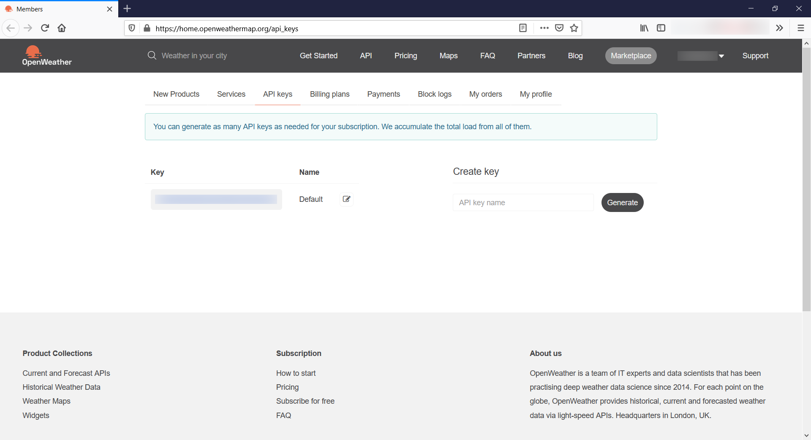
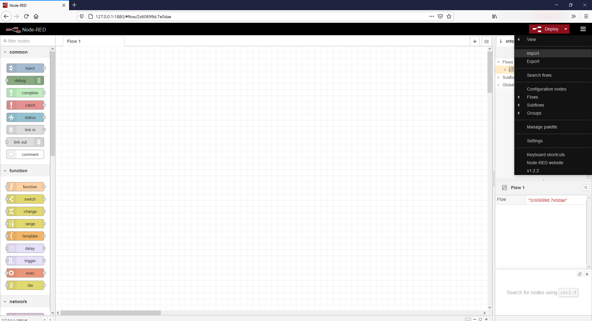
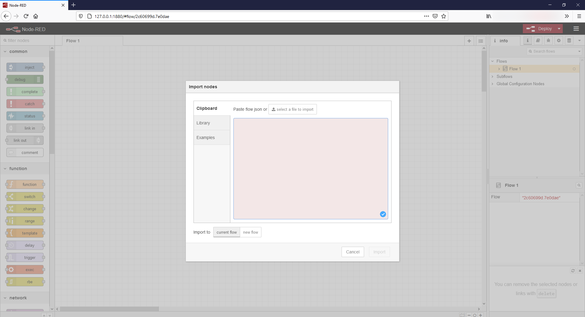

# Ciudades Inteligentes - IoT Noviembre 2020

Material de apoyo para la conferecia "Tecnologías de Internet of Things (IoT)", Noviembre 2020

La parte práctica del curso trata de crear una aplicación que lea datos de una fuente pública (OpenWeather), los guarde y muestre en un Dashboard. Una parte opcional adicional es conectarse a un servicio

Cada carpeta contiene parte del proyecto final, con el código ejemplo para cada funcionalidad. Una explicación es dada sobre cáda elemento y cómo configurarlo.

## Instalacion herramientas

Instale las siguientes herramientas para poder seguir los ejemplos. Necesitamos instalar nodejs (lenguaje de programación), nodered (paquete de software que ayuda la programación), algunos módulos adicionales para el nodered y genere una API Key del servicio OpenWeather.

### NodeJS

Vaya a la página de [nodejs](https://nodejs.org/en/download/) e instale la última versión, dependiendo de su sistema operativo.

#### Verificar Instalación con terminal

Luego de seguir las instrucciones, abra una línea de comando en su computador. Si no sabe cómo hacer esto, siga alguna de estas instrucciones:

- [Windows](https://www.lifewire.com/how-to-open-command-prompt-2618089)
- [Linux](https://ubuntu.com/tutorials/command-line-for-beginners#3-opening-a-terminal)
- [MacOS](https://support.apple.com/en-gb/guide/terminal/apd5265185d-f365-44cb-8b09-71a064a42125/mac)

Al abrir la línea de comando, escriba los siguientes comandos y presione ENTER.

```console
npm -v
node -v
```

Ambos comandos deberían devolverle un número, similar a estos:

```console
6.13.4
v12.16.1
```

Si no funciona, revise su instalación.

### NodeRed

Una vez instalado nodejs, abra una terminal con las instrucciones suministradas en [la sección anterior](####Verificar-Instalación-con-terminal).

Inserte el siguiente comando para instalar nodered:

```console
npm install -g --unsafe-perm node-red
```

Si está usando **Linux**, tal vez necesite usar el comando sudo para realizar la instalación:

```console
sudo npm install -g --unsafe-perm node-red
```

Si no salen mensajes de error, pruebe su instalación con el siguiente comando:

```console
node-red
```

Si su instalación funcionó, el comando habrá generado una serie de mensajes en su terminal. Uno de estos debe verse así:

```console
8 Nov 21:06:56 - [info] Server now running at http://127.0.0.1:1880/
```

Usando su navegador de internet de predilección, vaya a la dirección http vista en el mensaje. Debe ver la siguiente pantalla:



### Modulos nodered

Necesitamos instalar algunos paquetes adicionales para aumentar las capacidades de nodered.



Vaya a la barra superior, presione el botón derecho superior y seleccione la opción **Manage palette**.



Luego, seleccione la opción de buscar. Busque e instale los siguientes paquetes:



```console
node-red-node-openweathermap

node-red-dashboard
```

Luego de instalar estos paquetes, debe tener nuevos bloques en la barra izquierda de su nodered.

### Suscripción Openweather

Para poder consultar el clima en diversas partes del mundo, openweather ofrece un servicio para hacer consultas web y utilizar esos datos para nuestros proyectos.

Para esto, crearemos un usuario para así tener un API key (identificación para consultar el servicio de openweather programáticamente).



Primero, vaya a [esta página](https://home.openweathermap.org/users/sign_up) y cree un usuario:



Luego de seguir las instrucciones, vaya a [esta página](https://home.openweathermap.org/api_keys) y copie su API Key.



## Uso de ejemplos

Para poder usar los ejemplos, importe el código de cada carpeta, así se creará un nuevo Flow.

Vaya al botón superior derecho, y seleccione la opción **Import**



Luego pegue el código e importelo.



Para correr los ejemplos, presione el botón **Deploy**.
